<h1 align="center">Finance Dashboard Backend</h1>

## Overview

A **role-based backend system** for managing financial records and generating actionable insights.

This project demonstrates backend engineering concepts such as **API design, role-based access control, data modeling, and analytics processing** using Django and Django REST Framework.

---

## Key Highlights

- JWT-based Authentication
- Role-Based Access Control (RBAC)
- Financial Records Management (CRUD)
- Advanced Analytics APIs (not just CRUD)
- Filtering & Pagination
- Soft Delete Support
- Swagger API Documentation
- Modular & Scalable Architecture

---

## Architecture

The project is structured into modular Django apps:

```
finance_backend/
│── users/        # Authentication & roles
│── finance/      # Financial records
│── analytics/    # Dashboard insights
│── core/         # Shared utilities (future scalability)
```

---

## Architecture Diagram

```text
                ┌──────────────────────┐
                │      Client          │
                │ (Postman / Swagger) │
                └─────────┬────────────┘
                          │ HTTP Requests
                          ▼
                ┌──────────────────────┐
                │     Django API       │
                │ (DRF ViewSets/APIs)  │
                └─────────┬────────────┘
                          │
        ┌─────────────────┼─────────────────┐
        ▼                 ▼                 ▼
 ┌──────────────┐  ┌──────────────┐  ┌──────────────┐
 │   users app  │  │ finance app  │  │ analytics app│
 │ Auth & Roles │  │ Transactions │  │  Insights    │
 └──────────────┘  └──────────────┘  └──────────────┘
                          │
                          ▼
                ┌──────────────────────┐
                │      Database        │
                │      (SQLite)        │
                └──────────────────────┘
```

### Architecture Explanation

- **users app** → Handles authentication & role-based access
- **finance app** → Manages financial records (CRUD operations)
- **analytics app** → Processes aggregated insights for dashboard
- **Django REST Framework** → Acts as API layer
- **Database (SQLite)** → Stores structured financial data

This modular architecture ensures **separation of concerns, scalability, and maintainability**.

---

## User Roles & Permissions

| Role    | Permissions                |
| ------- | -------------------------- |
| Viewer  | Read-only access           |
| Analyst | Read + Analytics           |
| Admin   | Full access (CRUD + users) |

---

## Financial Records Features

- Create, update, delete financial records
- Track income and expenses
- Categorization (Food, Salary, Travel, etc.)
- Date-based tracking
- User-specific data isolation

---

## Analytics Features

- Total Income
- Total Expenses
- Net Balance
- Category-wise breakdown
- Monthly trends
- Recent activity
- Top spending category

These APIs provide **insight-driven data**, not just raw records.

---

## API Endpoints

### Authentication

- `POST /api/auth/register/`
- `POST /api/auth/login/`

### Financial Records

- `GET /api/records/`
- `POST /api/records/`
- `PUT /api/records/{id}/`
- `DELETE /api/records/{id}/`

### Analytics

- `GET /api/analytics/summary/`
- `GET /api/analytics/category/`
- `GET /api/analytics/trends/`
- `GET /api/analytics/recent/`
- `GET /api/analytics/top-category/`

---

## Authentication Flow

1. Register user
2. Login → receive JWT token
3. Use token in requests:

```
Authorization: Bearer <access_token>
```

---

## Screenshots

### Register API

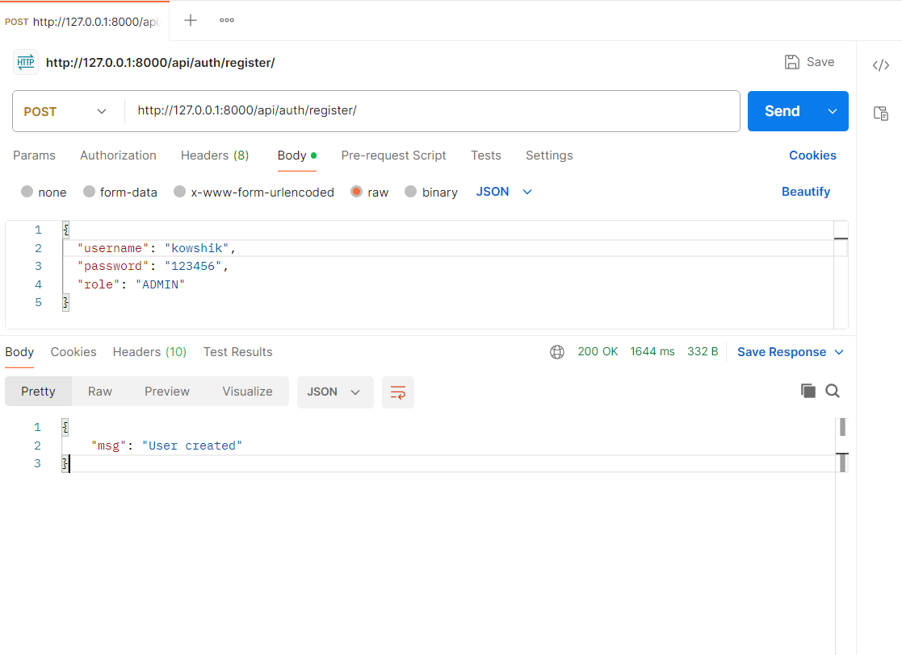

---

### Login (JWT Token)

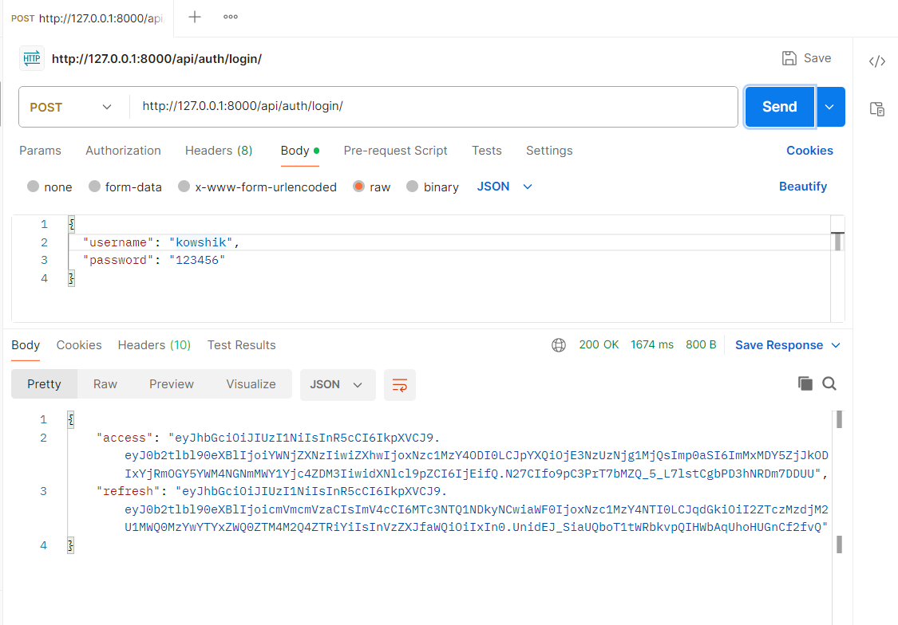

---

### Authorization (Bearer Token)

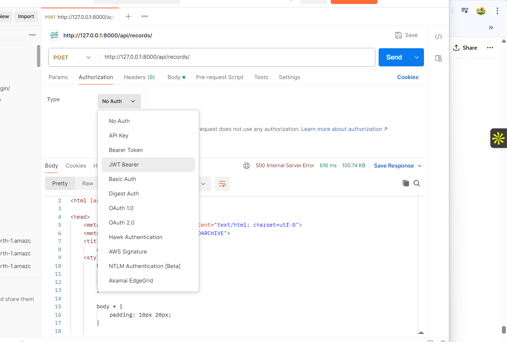

---

### Create Financial Record

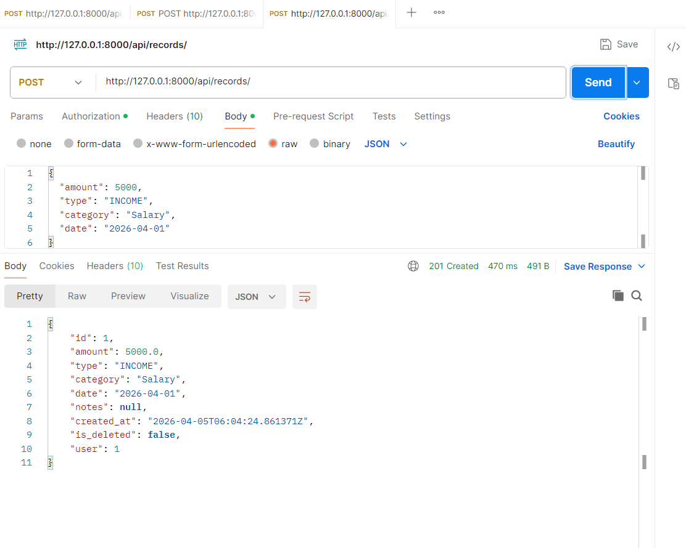

---

### Get Records

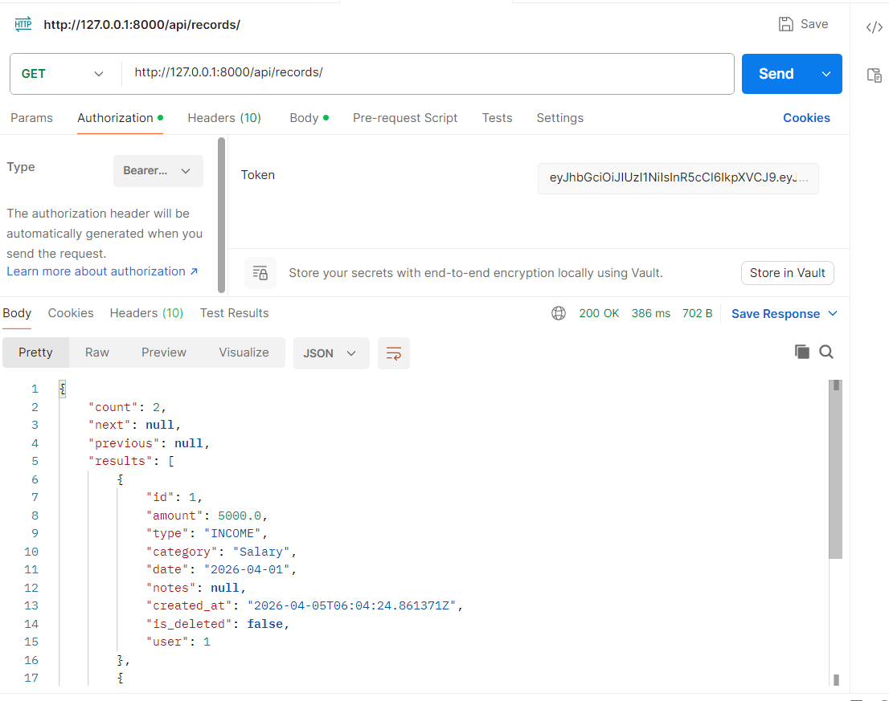

---

### Filtering Records

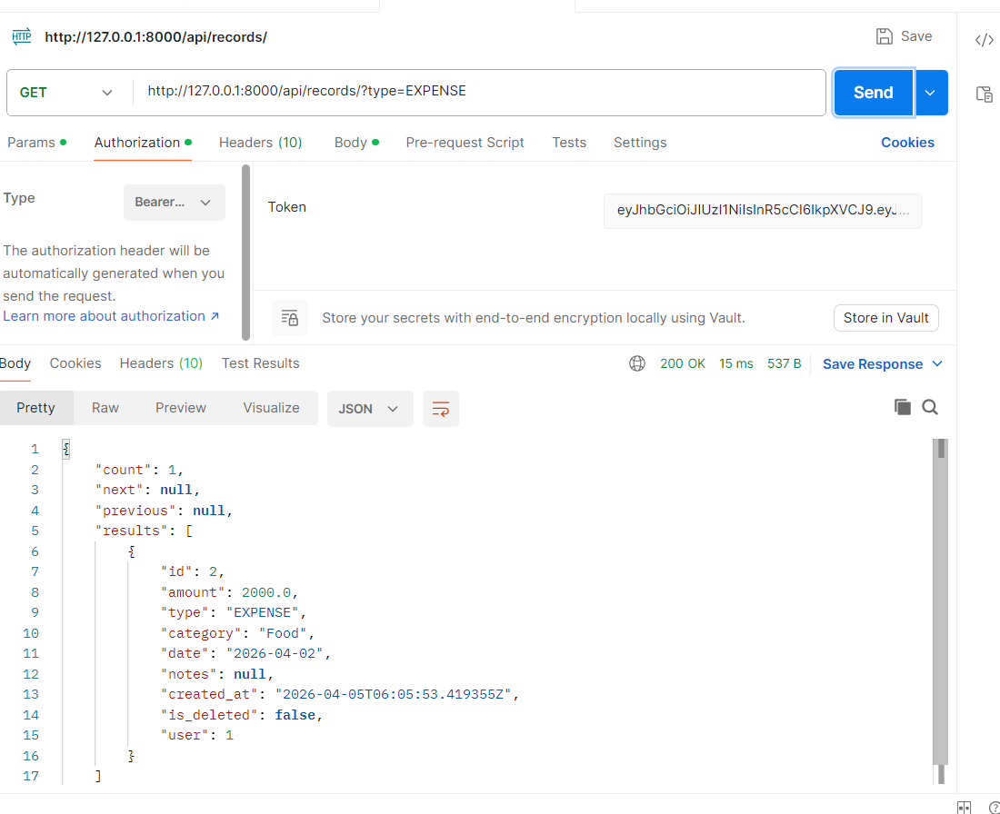
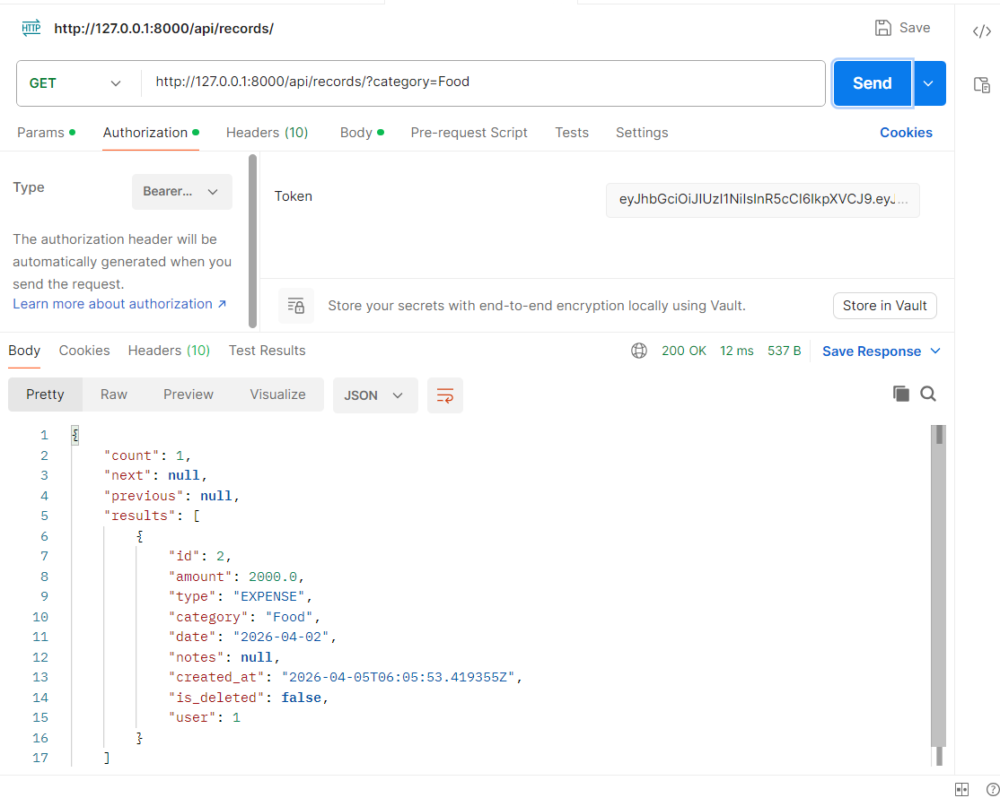

---

### Analytics - Summary

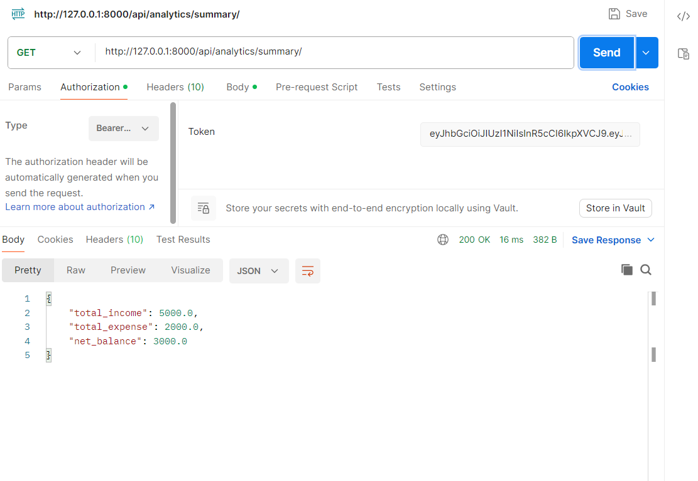

---

### Analytics - Category

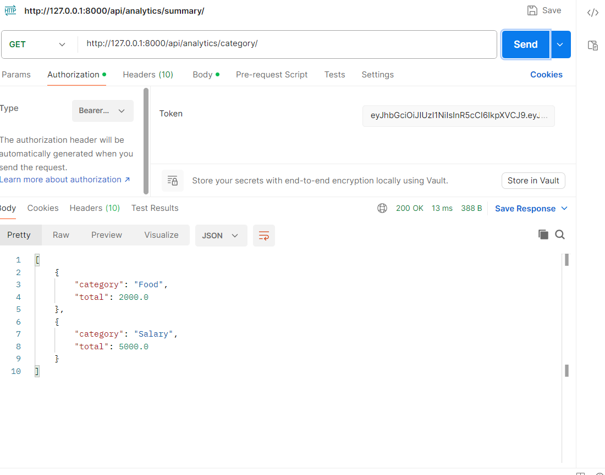

---

### Analytics - Trends

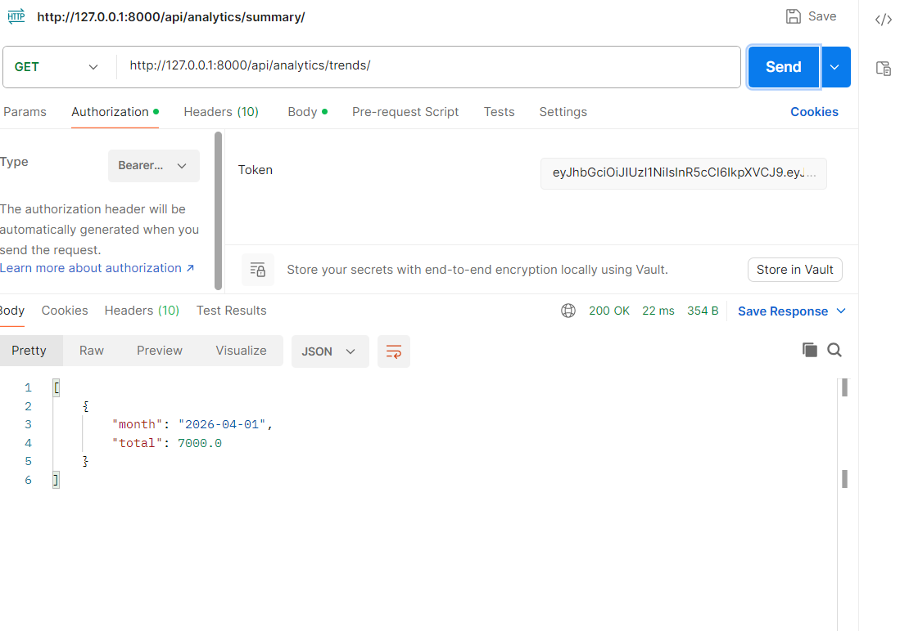

---

### Analytics - Recent Activity

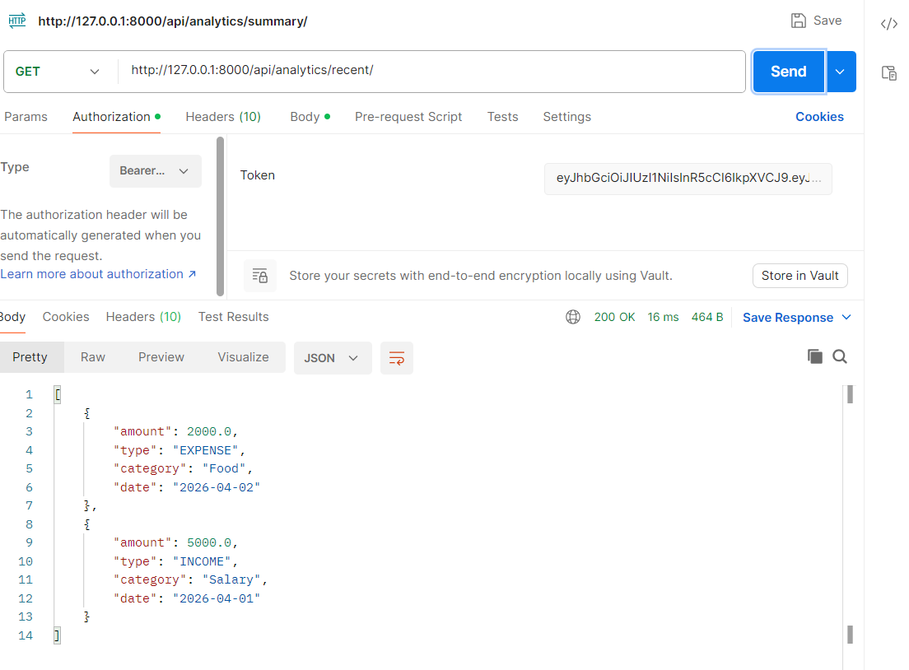

---

### Top Spending Category

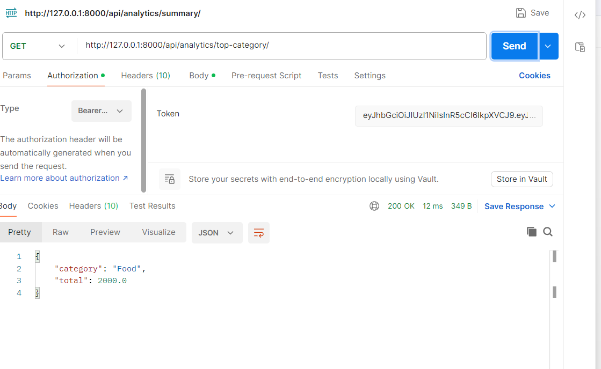

---

### Role-Based Restriction (Viewer Blocked)

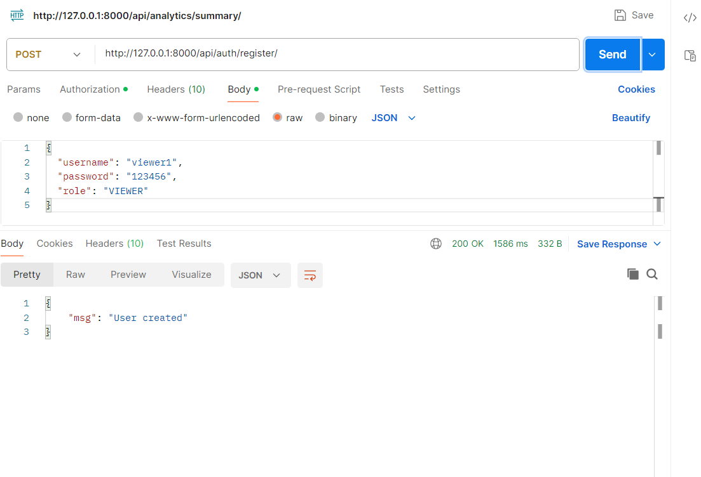
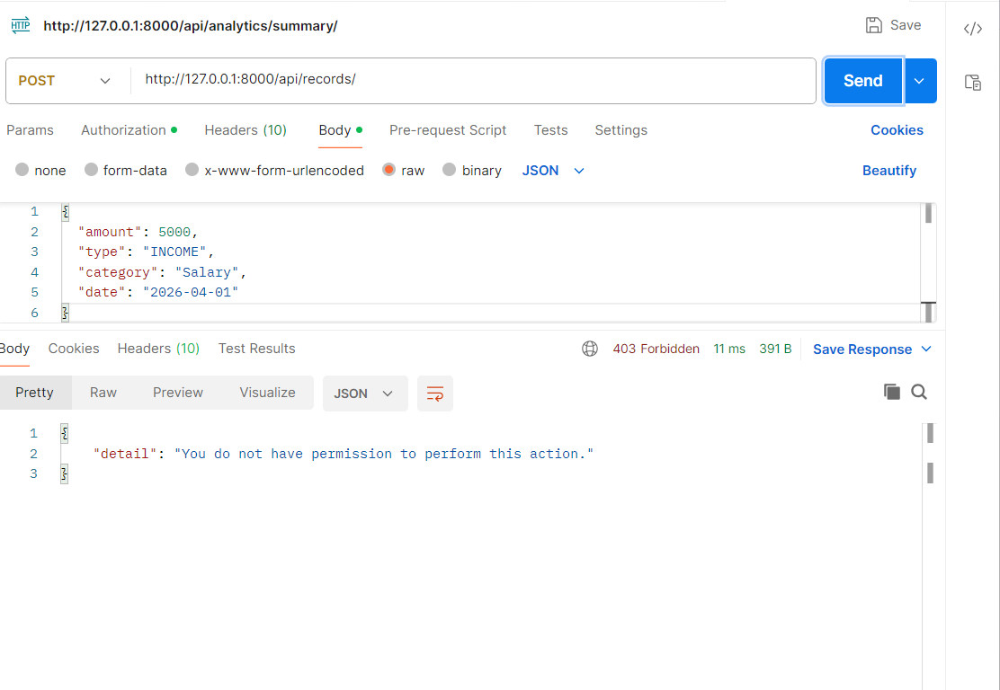

---

## Tech Stack

- Backend: Django, Django REST Framework
- Database: SQLite
- Authentication: JWT (SimpleJWT)
- API Docs: Swagger (drf-yasg)

---

## Setup Instructions

```bash
git clone <your-repo-link>
cd finance_backend

pip install -r requirements.txt

python manage.py makemigrations
python manage.py migrate

python manage.py runserver
```

---

## API Documentation

Access Swagger UI:

```
http://127.0.0.1:8000/swagger/
```

(local development)

## Design Decisions

- Used **custom user model** to support RBAC from the core
- Implemented **user-level data isolation** for security
- Separated **analytics logic from CRUD operations**
- Used **ModelViewSet** for efficient API design
- Added **soft delete** for data safety

---

## Assumptions

- Single-user ownership of financial data
- Basic role model sufficient for assignment
- SQLite used for simplicity

---

## Trade-offs

- No caching implemented (can be added for scalability)
- SQLite instead of production DB (PostgreSQL)
- No frontend included (API-focused design)

---

## Future Improvements

- Budget alerts & spending insights
- Graph-based analytics dashboard
- Multi-user shared finance tracking
- Deployment with Docker & PostgreSQL

---

## What Makes This Project Stand Out

> Instead of just implementing CRUD APIs, this project focuses on **role-based security, clean architecture, and insight-driven analytics**, demonstrating real-world backend engineering thinking.

---

## Acknowledgement

This project was developed as part of a backend engineering assessment for the **Backend Developer Intern role at [Zorvyn FinTech Pvt. Ltd.](https://zorvyn.com/)**.

It demonstrates practical skills in:

* API design and backend architecture
* Role-based access control (RBAC)
* Data modeling and persistence
* Building insight-driven analytics systems

I would like to thank the team at **[Zorvyn FinTech Pvt. Ltd.](https://zorvyn.com/)** for providing this opportunity to apply backend development concepts in a real-world scenario and showcase my engineering approach.

---

## Contact

<div align="center">

### **Kowshik BH**

[](mailto:kowshikbh18@gmail.com)
[](https://www.linkedin.com/in/kowshikbh)
[](https://github.com/Kowshik-bh18)

</div>

---
